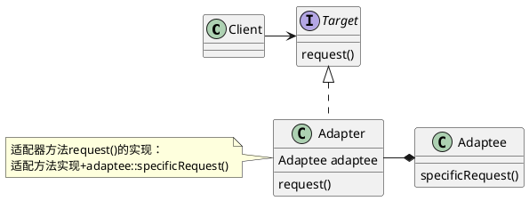
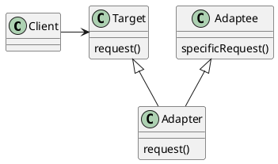

# 设计模式dd

## 基础知识

组合has a A，b挂了a也挂了。

```C++
class A
{
};
class B
{
A a;
};
```

聚合contains a A，b挂了a还在。

```C++
class A
{
};
class B
{
A* pa;
};
```

## 策略模式

定义了算法族，分别封装起来，让它们之间可以互相替换，此模式让算法的变化独立于使用算法的客户。

算法是组合在类中的

`设计原则：多用组合，少用继承。`

## 装饰者模式

动态地将责任附加到对象上。若要扩展功能，装饰者提供了比继承更有弹性的替代方案。

```puml
class Component{
    methodA()
    methodB()
}
class ConcreteComponent{
    methodA()
    methodB()
}
class Decorator{
    Component wrappedObj
    methodA()
    methodB()
}
note left :Decorator与被修饰的组件继承于同一个组件，\n这样装饰者既可以装饰被修饰的组件，\n也可以装饰另一个装饰者。\n换句话说，\nDecorator::wrappedObj既可以是ConcreteComponent，\n也可以是ConcreteDecorator。
class ConcreteDecoratorA{
    Component wrappedObj
    methodA()
    methodB()
    newBehavior()
}
note left:装饰者方法一般实现是：\nConcreteDecoratorA::methodA() = \n本装饰者实现+wrappedObj::methodA()

class ConcreteDecoratorB{
    Component wrappedObj
    Object newState
    methodA()
    methodB()
    newBehavior()
}
Component <|-- ConcreteComponent
Component <|-- Decorator
Component *-- Decorator

Decorator<|--ConcreteDecoratorA
Decorator<|--ConcreteDecoratorB
```

## 工厂方法模式

定义了一个创建对象的接口，但由子类决定要实例化的类是哪一个。工厂方法让类把实例化延迟到子类。

```puml
class Product
class ConcreteProduct
note bottom:所有的产品都继承于Product。这样一来，\n使用使用这些产品的类就可以引用这个接口\n而不是具体类了。
class Creator{
    {abstract}factoryMethod()
    {abstract}anOperation()
}
note right:Creator实现了所有操控产品的方法\n(实现中也只是用Product提供的接口，遵守依赖倒置原则)，\n但不实现工厂方法。
class ConcreteCreator{
    factoryMethod()
}
note right:ConcreteCreator实现factoryMethod()\n以实际制造出产品。

Product<|--ConcreteProduct
Creator<|--ConcreteCreator
ConcreteProduct<-ConcreteCreator
```

## 依赖倒置原则

要依赖抽象，不要依赖具体类。

## 命令模式

将“请求”封装为对象，以便使用不同的请求、队列或者日志来参数化其他对象。命令模式也支持可撤销的操作。

## 适配器模式

将一个类的接口，转换成客户期望的另一个接口。适配器让原本接口不兼容的类可以合作无间。

### 对象适配器



### 类适配器



## 外观模式

提供了一个统一的接口，用来访问子系统中的一群接口。外观定义了一个高层接口，让子系统更容易使用。

`1 外观不只是简化接口，也将客户从组件的子系统中解耦`
`2 适配器将一个对象包装起来改变其接口；装饰者将一个对象包装起来以增加新的行为和责任；而外观将一群对象包装起来以简化接口`

模式|意图
---|---
装饰者|不改变接口，但加入责任
适配器|将一个借口转成另一个接口
外观|让接口更简单

## 最少知识原则

在一个对象的方法内，我们只应该调用属于以下的方法：

* 该对象本身
* 被当做方法的参数而传递进来的对象
* 此方法所创建或实例化的任何对象
* 对象的任何组件

不用用这个实现(方法中，我们从气象站取得温度计，然后调用温度计的方法来获取温度)

```java
public float getTemp(){
    Thermometer thermometer = station.getThermometer();
    return thermometer.getTemperature();
}
```

使用以下实现(首先我们在气象站中加进一个方法，然后直接调用气象站的方法来获取温度)

```java
public float getTemp(){
    return station.getTremperature();
}
```

## 模板方法模式

在一个方法中定义一个算法的骨架，而将一些步骤延迟到子类中。模板方法使得子类可以在不改变算法结构的情况下，重新定义算法中的某些步骤。

```puml
class AbstractClass{
    templateMethod()
    {abstract} primitiveOperation1()
    {abstract} primitiveOperation2()
    primitiveOperation()
}
note right:基类为抽象类，基类的"步骤"函数可以是抽象也可以是具体的。\n而基类的"算法"函数必须是具体的，显示具体的算法。\n例如：\nfinal void templateMethod()\n{\nprimitiveOperation1();\nprimitiveOperation2();\n}
class ConcreteClass{
    primitiveOperation1()
    primitiveOperation2()
}
note right:子类是具体类，实现基类抽象的"步骤"函数。
AbstractClass<|--ConcreteClass
```

模式|叙述
---|---
模板方法|子类决定如何实现算法中的某些步骤
策略|封装可互换的行为，然后使用委托来决定要采用哪一个行为
工厂方法|由子类决定实例化哪个具体类

### 钩子(hook)

钩子是一种被声明在抽象类中的具体方法，但只有空的或者默认的实现。钩子的存在，可以让子类有能力对算法的不同点进行挂钩。

*用途一:钩子可以让子类是实现算法中的可选部分，或者在钩子对于子类的实现并不重要的时候，子类可以对此钩子置之不理。

```C++
public abstract class Base
{
    void templateMethod()
    {
        "步骤一"
        "步骤二"
        primitiveOperation2();
        if(hook())
        {
            "步骤三"
        }
    }
    bool hook()
    {
        return true;
    }
}

public class Inherit:public Base
{
    "步骤一的具体实现"
    "步骤二的具体实现"
    bool hook()
    {
        "hook的具体实现"
    }

}
```

*用途二：让子类能够有机会对模板方法中某些即将发生的(或者刚刚发生的)步骤作出反应。

## 好莱坞原则

别调用(打电话给)我们，我们会调用(打电话给)你。

### 好莱坞原则与依赖倒置原则之间的关系如何？

依赖倒置原则教我们尽量避免使用具体类，而多使用抽象。而好莱坞原则是用在创建框架或组件上的一种技巧，好让底层组件能够被挂钩进计算中，而且又不会让高层组件依赖底层组件。两者的目标都是在于解耦，但是依赖倒置原则更加注重如何在设计中避免依赖。
好莱坞原则教我们一个技巧，创建一个有弹性的设计，允许底层结构能够互相操作，而又防止其他类太过依赖它们。

## 迭代器与组合模式

### 迭代器模式

提供一种方法顺序访问一个聚合对象中的各个元素，而又不暴露其内部的表示。

```puml
interface Aggregate{
    {abstract}createIterator()
}

class ConcreteAggregate{
    createIterator()
}
note bottom:ConceteAggregate类持有一个对象的集合，\n并通过createIterator()返回集合的迭代器。

class Client
note top:集合由很多种(例如数组、ArrayList),其中生成的迭代器也有很多种，\n但是我们都让他们继承Aggregate、Iterator接口。\n所以对Client来说，他们操作是一样的。

interface Iterator{
    {abstract}hasNext()
    {abstract}next()
    {abstract}remove()
}

class ConcreteIterator{
    hasNext()
    next()
    remove()
}

Aggregate<|..ConcreteAggregate
Iterator<|..ConcreteIterator
Aggregate<-Client
Client->Iterator
ConcreteAggregate->ConcreteIterator
```

## 单一责任

一个类应该只有一个引起变化的原因。(类的每个责任都有改变的潜在区域。超过一个责任，意味着超过一个改变区域。所以尽量让每个类保持单一责任。)

### 内聚(cohesion)

当一个模块或一个类被设计成只支持一组相关的功能时，我们说它具有高内聚；反之，当被设计成支持一组不相关的功能时，我们说它具有低内聚。高内聚的类更容易维护。

## 组合模式

允许你将对象组合成树形结构来表现"整体/部分"层次结构。组合能让客户以一致的方式来处理个别对象以及对象组合。

```puml
class Client

class Component{
    add(Component)
    remove(Component)
    getChild(int)
    operation()
}
note top:在Component类中既有对组合的方法(如add()、remove()和getChild())\n也有对叶子结点的方法(operation)。\n这样或许违背了单一责任设计原则，但换取了透明性，\n即客户对一个节是叶子结点还是组合是不清楚的。\n从另一个理解来说，叶子结点是没有孩子的组合。
class Component
note right:我们可以把Component中方法的实现都抛出异常，例如叶子结点元素只会隐藏operation()，则客户误使用叶子结点中的其他方法则会报错。
class Leaf{
    operaton()
}
note bottom:叶子结点通过实现operation()，\n定义了组合内元素的行为。

class Composite{
    add(Component)
    remove(Component)
    getChild(Component)
    operaton()
}
note left:Composite中有孩子，\n属性中有Component。

Client->Component
Component <|-- Leaf
Component <|-- Composite
Composite --> Component
```

**组件、组合、树？我被搞混了**
组合包含组件。组件有两种：组合与叶子结点元素。听起来像递归，组合持有一群孩子，这些孩子可以是别的组合或者叶子结点元素。

模式|描述
---|---
组合|客户可以将对象的集合以及个别的对象一视同仁
迭代器|提供一个方式来遍历集合，而无须暴露集合的实现。

## 状态模式

允许对象在内部状态改变时改变它的行为，对象看起来好像修改了它的类。

```puml
class Context{
    request()
}
note bottom:request()代指一类方法，\n其方法的实现是调用具体状态对象里的方法。\n例如：\nhandle()\n{\nstate.handle()\n}\n只要有人调用Context的request()方法，\n它就会被委托到状态对象来处理。
class Context
note top:State对象是用组合的方式放在该类的
interface State{
    {abstract}handle()
}
note top:State接口定义了一个所有具体状态的共同接口；\n任何状态都实现这些相同的接口，\n这样一来，状态之间可以互相替换。
class ConcreteStateA{
    handle()
}

class ConcreteStateB{
    handle()
}

Context -> State
State <|-- ConcreteStateA
State <|-- ConcreteStateB
```

**在状态模式下，改变状态的动作应该放在哪里，是Context类还是State的具体对象呢？**
都可以。一般来讲，当状态转变都是固定的，就放在Context中；然而，当状态转变更加动态，通常就放在状态类中。Context设置为对修改封闭。
将状态转换放到状态类中的缺点是：**状态类之间产生了依赖关系。**

## 复合模式

* MVC是符合模式，结合观察者模式、策略模式和组合模式。
* 模型使用观察者模式，以便视图更新，同时保持两者之间的解耦。
* 控制器是视图的策略，视图可以使用不同的控制器实现，得到不同的行为。
* 视图使用组合模式实现用户界面，用户界面通常使用嵌套的组件，像面板、框架和按钮。
* Model 2是MVC在Web上的应用。在Model 2中，控制器实现成Servlet，而JSP/HTML实现视图。

DJview 的设计思路
测试类实例化模型，然后以模型对象为参数构造控制器。
模型类中没有控制器的引用，因为它不会主动与控制器交互。虽然它没有视图引用，但是它有观察者组合，把视图对象加进去，并提供通知接口，使得状态改变可以及时通知视图对象。当控制器调用模型的命令接口时，命令接口中会调用改变状态变量的接口。改变状态变量接口一方面改变状态，一方面调用通知观察者接口。

控制器成员对象既有视图引用也有控制器引用，因为它是MVC夹心饼中间的奶油。控制器的命令接口会被视图类的监控函数调用，在其中，控制器的命令接口会调用模型的命令接口，也会调用视图的改变状态的接口(比如，按钮按下后会变成灰色)。

视图类继承了观察者接口(BPMObserver，提供模型状态改变通知观察者的接口，也就是更新函数)和监听者接口(ActionListener，提供按键的监听器，通过判断event参数来判断是那个按键按下)。视图持有模型和控制器的引用，模型是在观察者接口中的更新函数里使用来获取模型状态变量的，控制器是在监听函数里用到。同时创建了所有的Swing组件，并提供了改变或获取这些Swing组件属性的接口。当视图按键按下时，监听器会触发监听函数并通过入参的事件来判断是那个Swing组件触发的。然后获取当前Swing组件的属性，调用控制器的命令函数来处理。


## 桥接模型

将抽象部分与实现部分分离，使它们都可以独立的变化。

```puml
class Client
class Abstraction{
    implementor
    +Operation()
}
note left:函数实现\nOperation()\n{\nimplementor.OperationImp()\n}\n
class ConcreteAbstrator{
    +Operation()
    +Operation1()
}
note bottom:具体的面向客户接口的类中，\n有继承基类的函数，有自己实现的函数，\n如果新添的函数可以用本类已有的函数实习就可以不用在Implementor接口实现。\n例子:\nOperation1()\n{\nreturn operation()+1;\n}
interface Implementor{
    {abstract}+OperaionImp()
}
class ConcreteImplementorA{
    +OperationImp()
}
class ConcreteImplementorB{
    +OperationImp()
}
Client-->Abstraction
Abstraction<|--ConcreteAbstrator
Abstraction o->Implementor:implementor
Implementor<|--ConcreteImplementorA
Implementor<|--ConcreteImplementorB
```

桥接的优点：

* 将实现(Implementor)予以解耦,让它和界面(Abstractor)之间不在永久绑定，是使用HasA来实现的。
* 抽象和实现可以独立扩展，不会影响到对方。

桥接的用途和缺点：

* 适合使用在需要跨越多个平台的图形和窗口系统上。
* 当需要用不同的方式改变接口和实现时，你会发现桥接模式很好用。
* 缺点是增加的系统的复杂性。

## 生成器

使用生成器模式(Builder Pattern)封装一个产品的构造过程，并允许按步骤构造。

```puml
class Client{
    -builder
    +construct()
}
note left:construct()\n{\nbuilder.buildPartA();\nbuilder.buildPartB();\nreturn builder.getResult()\n}
interface AbstractBuilder{
    {abstract}+buildPartA()
    {abstract}+buildPartB()
    {abstract}+getResult()
}
class ConcreteBuilder{
    -product
    +buildPartA()
    +buildPartB()
    +getResult()
}
note bottom:buildPart()把零件装配到product中，\n然后由getResult()返回结构。\n**不同的具体构建者会构建不同的但构造步骤一样的产品**。
class Product
Client o-> AbstractBuilder:builder
AbstractBuilder<|--ConcreteBuilder
Product <-o ConcreteBuilder:product
```

生成器的优点

* 将一个复杂对象的创建过程封装起来。
* 允许对象通过多个步骤来创建，并且可以改变过程。(这和只有一个步骤的工厂模式不同)
* 产品的实现可以被替换，因为客户只看到一个抽象的接口。

生成器的用途和缺点

* 经常用来创建组合结构
* 与工厂模式相比，采用生成器模式厂家创建对象的客户，需要具备更多的领域知识。(因为客户需要知道产品装配步骤，模式只是封装了产品装配的细则)

* 所创建的产品一般具有较多的共同点，如果产品之间的差异性很大，例如很多组成部分都不相同，不适合使用生成器模式。

* 如果产品的内部变化复杂，可能会导致需要定义很多具体建造者类来实现这种变化，导致系统变得很庞大，增加系统的理解难度和运行成本。

## 责任链

当你想要让一个以上的对象有机会能够处理某个请求的时候，就使用责任链模式(Chain of Responsibility Pattern)。

```puml
class Client{
    handler
}
note top:Client和ConcreteHandler都有handler对象
class Handler{
    -handler
    {abstract}+handlerRequest()
    +setHandler()
    +getHandler()
}
note right:handlerRequest()\n{\n各具体处理器具体实现\nif(没有处理完毕)\n{getHandler().handlerRequset()\n\\\\责任链下一个处理器的处理环节\nreturn\n}
class ConcreteHandler1{
    handlerRequest()
}
class ConcreteHandler2{
    handlerRequest()
}
class ConcreteHandler3{
    handlerRequest()
}

Client o-> Handler:handler
Handler<|--ConcreteHandler1
Handler<|--ConcreteHandler2
Handler<|--ConcreteHandler3
```

他们之间的数据结构是：

```puml
class Client{
    handler
}
class ConcreteHandler1{
    handler
}
class ConcreteHandler2{
    handler
}

Client o-> ConcreteHandler1:handler
ConcreteHandler1 o-> ConcreteHandler2:handler
```

责任链的优点

* 降低耦合度：得客户无需知道是哪一个对象处理其请求。客户仅需知道该请求会被“正确”地处理。接收者和发送者都没有对方的明确的信息，且链中的对象不需知道链的结构。
* 可以简化你的对象，因为它无需知道链的结构。
* 允许你动态地新增、删除或调动它们的次序。

责任链的用途和缺点

* 一个请求可能不会被所有对象处理，也可能因该链没有被正确配置而得不到处理。
* 可能造成循环调用
* 经常被使用在窗口系统中，处理鼠标和键盘子类的事件。
* 可能不容易观察允许时的特征，有碍于除错。

## 蝇量模型

如想莫个类的一个实例能用来提供许多“虚拟实例”，就使用蝇量模式（Flyweight Pattern），又叫享元模式。

```puml
class Client{
    object
}
class Objects{
    variableArray
    objectsFunction()
}
note right:使用数组和众对象的函数来维护多个相同的对象，\n而不是客户维护多个对象。
Client o-> Objects:object
```

蝇量的优点

* 减少运行时对象实例的个数，节省内存。
* 将许多"虚拟"对象的状态集中管理。

蝇量的用途和缺点

* 当一个类有许多实例，而这些实例能被同一方法控制的时候，我们就可以使用蝇量模式。
* 蝇量模式的缺点在于，一旦你实现了它，那么单个的逻辑实例将无法拥有独立而不同的行为。

## 解释器

使用解释器模型(Interpreter Pattern)为语言创建解释器。

一般语言的语法可以写成下面这样

```C++
expression ::= <command> | <sequence> | <repetiton>
//表达式可由命令、表达式队列和循环语句构成
sequence ::= <expression> ';' <expression>
//表达式队列是由多个表达式通过";"连接构成
repetition ::= while '(' <variable> ')' <expression>
//循环有while关键字、变量和表达式构成
varialbe ::= [A-Z,a-z]+
```

```puml
interface Atom{
    {abstract}interpret(context)
}
note left:编程语言的基本单位，\n也是语言解析的基本单位。\n每个Atom都有interpret(),\n传入的参数是需要解析的字符串输入流。
interface Expression{
    {abstract}interpret(context)
}
interface Repetetion{
    variable
    expression
    {abstract}interpret(context)
}
interface Sequence{
    expression1
    expression2
    ...
    {abstract}interpret(context)
}
interface Variable{
    {abstract}interpret(context)
}
interface Command
Atom <|-- Variable
Atom <|-- Expression
Variable<--o Repetetion:variable
Expression <|-- Repetetion
Expression <--o Repetetion:expression
Expression <|-- Sequence
Expression <--o Sequence:expression
Expression <|-- Command
```

解释器模式的优点

* 将每一个语法规则表示成一个类，方便于实现语言。
* 因为语法由许多类表示，所以你可以轻易地改变或扩展此语言。
* 通过在类结构中加入新的方法，可以在解释的同时增加新的行为，例如打印格式的美化或者进行复杂的程序验证。

解析器的用途和缺点

* 当你需要实现一个简单的语言时，使用解析器。
* 当你有一个简单的语法，而且简单比效率更重要时，使用解析器。
* 可以处理脚本语言和编程语言。
* 当语法规则的数目太大时，这个模式可能变得非常复杂。在这种情况下，使用解析器/编译器的产生器可能更合适。

## 中介者模式

使用中介者(Mediator Pattern)来集中相关对象之间复杂的沟通和控制方式。

```puml
interface Mediator{
    colleague
}
class Colleague{
    mediator
}
note bottom:Mediator和Colleague通过包含彼此的对象来实现相互依赖。\n同时Colleague应该有许多，他们不彼此相互交互，\n而是和中介者相互交互。
class ConcreteMediator{
    colleague
}
Mediator <|-- ConcreteMediator
Mediator o-> Colleague:colleague
Mediator <-o Colleague:mediator
```

中介者的优点

* 通过将对象彼此解耦，可以增加对象的复用性。
* 通过将控制逻辑集中，可以简化系统维护。
* 可以让对象之间所传递的消息变得简单而且大幅减少。

中介者的用途和缺点

* 中介者常常被用来协调相关的GUI组件。
* 中介者的缺点是，如果设计不当，中介者对象本身会变得过于复杂。

## 备忘录

当你需要让对象返回之前的状态时(例如，你的用户请求“撤销”)，就使用备忘录模式(MementoPattern)。

```puml
class Originator{
    -state
    -memento
    +restoreMemento(Memento m)
    +createMemento()
}
note bottom:原发器。负责创建一个备忘录\nncreateMemento(){\nreturn new Memento(state);\n}\n也可以利用备忘录恢复内部状态\nrestoreMemento(Memento m){\nstate=m.getstate();\n}
class Memento{
    -state
    +getState()
    +setState(state)
}
note right:备忘录，用于存储Originator的内部状态。\n在备忘录Memento中有两种接口，\nCaretaker只能看到窄接口，它只能将备忘录传递给其他对象。\nOriginator可以看到宽接口，允许它访问返回到先前状态的所有数据。
class Caretaker{
    memento
}
note right:负责人。负责保存好备忘录，\n不能对备忘录的内容进行操作和访问，只能够将备忘录传递给其他对象。
Originator o-> Memento:memento
Memento <--o Caretaker:memento
```

备忘录的优点：

* 将被储存的状态放到外面，不要和关键对象混在一起，这可以帮助维护内聚。
* 保持关键对象的数据封装。
* 提供了容易实现的恢复能力。

备忘录的用途和缺点

* 备忘录用于储存状态。
* 使用备忘录的缺点：存储和恢复状态的过程可能相当耗时。
* 在Java系统中，其实可以考虑使用序列化(serialization)机制存储系统的状态。

## 原型

当创建给定类的实例的过程很昂贵或很复杂时，就使用原型模式(Prototype Pattern)。

```puml
class Client{
    -prototype
    +makePrototype()
}
note bottom:makePrototype(){\nreturn prototype.clone();\n}
class Prototype{
    +clone()
}
note right:Prototype是给出clone()具体实现的抽象类
class ConcretePrototype{
    +clone()
}
Client o-> Prototype:prototype
Prototype<|--ConcretePrototype
```

原型的优点

* 向客户隐藏制造新实例的复杂性。
* 提供让客户能够产生未知类型的选项(也就是在Client::makePrototype()函数添加一个入参，然后通过对入参进行判断来找到合适的原型类来克隆)。
* 在某些环境下，复制对象比创建新对象更有效(克隆直接操作内存中的二进制流，特别是复制大对象时，性能的差别非常明显)。

原型的用途和缺点

* 在一个复杂的类层次中，当系统必须从其中的许多类型创建新对象时，可以考虑原型。
* 重复地创建相似对象时可以考虑使用原型模型。
* 缺点：对象的复制有时相当复制。原型中克隆是浅拷贝(这是针对java的Cloneable接口)，对于非基本类型(数组、容器、引用对象等)都不会拷贝。`注：java的String类型是深拷贝。`

## 访问者

当你想要为一个对象的组合增加新的能力，且封装并不重要时，就使用访问者模式(Visitor Pattern)。

```puml
class Client
interface Vistor{
    {abstract}-visitConcreteElement(ConcreteElement element)
}
class ConcreteVistor{
    -visitConcreteElement(ConcreteElement element)
    +getfunc1()
    +getfunc2()
}
note right:visitConcreteElement()函数获取ConcreteElement中的属性,\ngetfunc1()函数对属性进行操作然后返回需要的值。\n
class ObjectStruture
note bottom:一个元素的容器，如List、Set、Map等，\n在项目中一般很少抽象出这个角色。
interface Element{
    {abstract}+getState()
}
class ConcreteElement{
    +getState()
}
Client->Vistor
Vistor<|--ConcreteVistor
Client--->ObjectStruture
ObjectStruture -> Element
Element <|-- ConcreteElement
```

比如菜单中菜的结果是`ObjectStruture`维护的，想要获取菜单中某一食物是否是高蛋白食物。可以先通过`ObjectStruture`找到该食物，然后通过`visitElement()`获取众多参数，其中有一条是蛋白质比率，最后通过`getfunc1()`的算法判断并返回判断结果。

访问者的优点

* 允许你对组合结构加入新的操作，而无需改变结构本身。(可以在ConcreteVistor加入更多getfunc()，而ConcreteElement只提供getState())
* 访问者所进行的操作，其代码是集中在一起的。
* 元素类可以通过接受不同的访问者来实现对不同操作的扩展。

访问者的用途和缺点

* 当采用访问者模式的时候，就会打破组合类的封装。
* 因为游走的功能牵涉其中，所以对组合结构的改变就变得更加困难。
* 增加新的元素类比较困难。由于不同元素的有不同的属性，所有增加新的元素，我们需要重载Visitor::visitConcreteElement(ConcreteElement element)。在访问者类中，每一个元素类都有它对应的处理方法。在元素类数目不确定的情况下，应该慎用访问者模式。